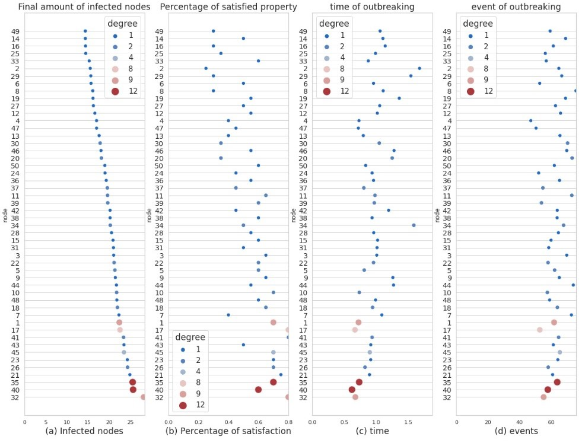

# Language for Modelling and Analysis of Collective Dynamics

This repository contains the code and models developed for my master thesis as part of the "Data Science and Economics" program. The thesis goal consists of  **developing a unifying modeling language to analyze, simulate, and monitor collective dynamics and spreading processes over Multiplex Multi-Layer Networks (MLNs). Inspired by Kappa rule-based formalism and Spatio-Temporal Reach and Escape Logic (STREL), this language aims to address standardization challenges in network science, providing a flexible, intuitive framework for diverse domains including epidemiology, sociology, and technology.** It manipulates the evolution of defined system by extensive application of Discrete-Time Markov Chains (DTMCs) and Continuous-Time Markov Chains (CTMCs) to determine properties of the collective such as probability of infection and amount of infected individuals depending on patient zero.



## Main File

- **`main.ipynb`**: The central Jupyter notebook that executes the primary analyses and workflows described in the thesis. Readers can follow this notebook to replicate the results. It contains detailed descriptions of the methodology, models, and results.

## Model constructor of the Thesis

- **`ParserThesis.py`**: the complementary set of functions to generate model components for the kappa model (http://www.kappalanguage.org/) and regulate the evolution of the dynamic system over time, as well as the syntactic construct to adapt the STREL logic to the proposed use cases.

## Input Files

The repository relies on the following input files and directories:
- **`Language files/`**: Contains definitions of states, parameters, initial  conditions, rules, view, simulation options, STREL properties (for an extensive guide refer to the Kappy API https://kasim.readthedocs.io/en/latest/tutorial.html).
- **`Network files/`**: Includes network-related data or model files necessary for the analysis.
- **`PRISM models and properties/`**: Includes PRISM model files and properties used for probabilistic model checking.

## Dependencies

The project dependencies are listed in the `requirements.txt` file. To install them, run:

```bash
pip install -r requirements.txt
```

Dependencies include:
- Python libraries such as `numpy`, `pandas`, `matplotlib`, etc.
- PRISM Model Checker: [PRISM website](http://www.prismmodelchecker.org/)

## How to Use

1. Install the required dependencies:
   ```bash
   pip install -r requirements.txt
   ```

2. Run the Jupyter notebook `main.ipynb` to execute the primary analyses:
   ```bash
   jupyter notebook main.ipynb
   ```

3. Utilize the input files from the relevant directories to replicate the results.

## Author

This repository was created as part of my master thesis program at Università degli Studi di Milano in collaboration with University of Konstanz.
